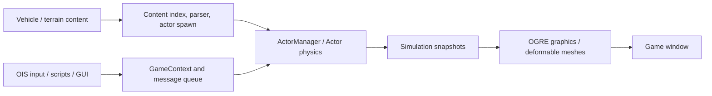

# Architecture

Source-grounded introduction for the baseline `e85535569102b6251849af574026984e3213b3f4`, inspected on 2026-10-08. Update this map when the fork changes.

## Proposed trial-platform extension

The current engine map below remains the baseline implementation. [Trial architecture options](doc/project/design/trial-platform-architecture-options.md) and their [HTML companion](doc/project/reports/trial-architecture-options-2026-10-08.html) evaluate a native force/energy observer, common environment service, isolated trial worker, .NET coordinator, and WPF or React workbench.

The complete evaluated architecture remains the roadmap. Slice 01 now implements an initial subset described below; full model attribution and scientific qualification remain unfinished. The evaluation recommends preserving current solver ordering for initial observation, recording generated/consumed force epochs, and validating energy/model coverage before scientific claims. D003 in the [implementation decision log](doc/project/design/implementation-decisions.md) selects a React workbench with a .NET coordinator, delivered through a local browser first. D011 selects scientific dashboards alongside the separate source-built RoR scene window, with interactive scientific 3D inspection later. The completed Q&A is consolidated in the [implementation specification](doc/project/design/trial-platform-implementation-spec.md) and [HTML review](doc/project/reports/trial-implementation-spec-2026-10-08.html): native tick instrumentation and recorder, uniform physical environment/adapters, controlled coast execution, sequential isolated workers, retained archive/analysis and React scientific views. It defines 14 epics and five delivery gates. Wire/storage layouts, numerical limits and resource defaults are proposals requiring qualification. The static [platform landscape](platform.md) provides capability evidence.

## Implemented trial foundation — Slice 01

- **Native:** ActorManager brackets actor force jobs with an actor-owned ledger and publishes completed aggregate records after the physics barriers. CalcNodes observes the actual force and pre/post velocity at integration. Trial mode initializes coherent body/wheel rolling velocity after settling, applies pilot gravity/density/steady wind, and acknowledges pause/resume after synchronization.
- **Capture:** TrialRuntime passes every-step aggregates through a bounded 32,768-record SPSC queue to an independent writer. Chunks contain explicit little-endian records, CRC-32 and completion markers; grouped durable flushes and a footer distinguish verified prefixes from clean complete archives. Required loss never blocks the physics producer.
- **Coordinator:** apps/trials/coordinator owns immutable revisions, sequential fresh workers/private profiles, process/content provenance, typed local commands, a retained archive and a SQLite catalog. Execution, capture and validation are independent states. Retry creates a fresh attempt; interruption never restores a physical checkpoint.
- **Workbench:** apps/trials/workbench provides a local React form, queue, native-clock status, force/energy/momentum charts, environment, event timeline, artifacts and controls. Native RoR remains a separate window. Charts are a reduced projection; the archive retains every recorded aggregate tick.
- **Quality:** Total consumed force and ground/object-contact deltas are observed; beam/aero/drive/hydro/free-force attribution and conservative/dissipative energy terms remain incomplete. Kinetic-work and momentum update residuals test the integration boundary, not whole-model conservation. All attempts remain scientific validation NotReady.

See [the runbook](apps/trials/README.md), [Slice 01 evidence](doc/project/slices/slice-01.md), and [the source observer](source/main/trials/TrialRuntime.cpp). The current capability is restricted to one pinned pilot actor and controlled coast. The supplied game profile uses this workstation's verified Direct3D9 renderer.

## System shape

Rigs of Rods is a native C++ application. Its own application loop coordinates input, simulation, scripting, graphics, audio, and GUI. Vehicles are actors built from nodes, beams, wheels, engines, and other components. Content files describe those actors and their terrain; they are separate from the engine executable.

The diagram summarizes data flow. It does not imply that all subsystems are isolated or that every action travels through the message queue.

## Source map

| Area | Main entry points | Responsibility |
| --- | --- | --- |
| Application lifecycle | [main.cpp](source/main/main.cpp), [AppContext.cpp](source/main/AppContext.cpp), [Application.h](source/main/Application.h) | Startup, filesystem setup, rendering window, input listeners, global services and configuration variables |
| Simulation orchestration | [GameContext.cpp](source/main/GameContext.cpp), [GameContext.h](source/main/GameContext.h) | Simulation state, actor lifecycle, terrain transitions, and queued `MsgType` requests |
| Input and configuration | [InputEngine.cpp](source/main/utils/InputEngine.cpp), [CVar.cpp](source/main/system/CVar.cpp), [AppConfig.cpp](source/main/system/AppConfig.cpp), [AppCommandLine.cpp](source/main/system/AppCommandLine.cpp) | OIS input/events, CVars, persistent settings, and CLI options |
| Actor construction | [ActorSpawner.cpp](source/main/physics/ActorSpawner.cpp), [ActorSpawnerFlow.cpp](source/main/physics/ActorSpawnerFlow.cpp), [rig_def_fileformat](source/main/resources/rig_def_fileformat) | Vehicle definition parsing/validation and construction of simulation/visual components |
| Physics | [ActorManager.cpp](source/main/physics/ActorManager.cpp), [Actor.h](source/main/physics/Actor.h), [ActorForcesEuler.cpp](source/main/physics/ActorForcesEuler.cpp), [SimData.h](source/main/physics/SimData.h) | Physics scheduling, actor state, force/integration steps, and node/beam data |
| Collision | [Collisions.cpp](source/main/physics/collision/Collisions.cpp), [DynamicCollisions.cpp](source/main/physics/collision/DynamicCollisions.cpp), [PointColDetector.cpp](source/main/physics/collision/PointColDetector.cpp) | Ground/object and actor collision handling |
| Graphics | [gfx](source/main/gfx), [SimBuffers.h](source/main/gfx/SimBuffers.h), [FlexBody.cpp](source/main/physics/flex/FlexBody.cpp) | OGRE scene/actor graphics, simulation snapshots, CPU mesh deformation |
| Terrain | [Terrain.h](source/main/terrain/Terrain.h), [TerrainGeometryManager.cpp](source/main/terrain/TerrainGeometryManager.cpp), [TerrainObjectManager.cpp](source/main/terrain/TerrainObjectManager.cpp), [ProceduralRoad.cpp](source/main/terrain/ProceduralRoad.cpp) | Terrain geometry, objects, roads, and environment |
| Resources | [ContentManager.cpp](source/main/resources/ContentManager.cpp), [CacheSystem.cpp](source/main/resources/CacheSystem.cpp) | OGRE resource groups, packaged resources and mod discovery/indexing |
| Scripting | [ScriptEngine.cpp](source/main/scripting/ScriptEngine.cpp), [GameScript.cpp](source/main/scripting/GameScript.cpp), [bindings](source/main/scripting/bindings) | AngelScript runtime, game API, and native type/function bindings |
| UI, audio, network | [gui](source/main/gui), [audio](source/main/audio), [network](source/main/network) | ImGui panels, MyGUI HUD/dashboard integration, OpenAL audio, and multiplayer/network services |
| Build and dependencies | [CMakeLists.txt](CMakeLists.txt), [conanfile.py](conanfile.py), [DependenciesConfig.cmake](cmake/DependenciesConfig.cmake), [conan_provider.cmake](cmake/conan_provider.cmake) | Targets, options, dependency graph, and Conan/CMake integration |
| Build products | [source/main/CMakeLists.txt](source/main/CMakeLists.txt), [version_info](source/version_info), [angelscript_addons](external/angelscript_addons) | RoR executable/resources, generated commit/date version information, and compiled script addons |
| CI | [build-game.yml](.github/workflows/build-game.yml) | Upstream Windows/Linux build workflow |

## Simulation and rendering

[SimConstants.h](source/main/physics/SimConstants.h) defines `PHYSICS_DT = 0.0005f`, a fixed 0.5 ms physics step. ActorManager determines the number of steps needed from elapsed time and retains the remainder. Work can run asynchronously and uses worker tasks for actor forces and collision work.

Graphics uses the snapshots described in `gfx/SimBuffers.h`, including `GameContextSB`, `ActorSB`, and `NodeSB`. Simulation is synchronized for copying data, then rendering can consume the snapshots while simulation proceeds. Deformable visual meshes are updated from simulated node positions.

The code still contains shared services and coupling. When changing physics or threading, inspect synchronization, actor lifetime, and ownership rather than assuming snapshots make arbitrary cross-thread reads safe. Recheck timing assumptions if changing integration, simulation speed, or scheduling.

## Content and scripting

The `content/` Git submodule supplies starter assets. Community mods and user profiles are external data; their versions and licenses can differ from the engine. A source build needs the recorded content revision as well as compiled code to reproduce a session.

The content cache indexes discoverable vehicles and terrains. A new portable profile can rebuild that cache on first launch. A missing or stale cache is a runtime/content issue rather than evidence of failed C++ compilation.

AngelScript supports startup `main()` and per-frame `frameStep(float)`; `-runscript` selects a startup script. Scripts can drive inputs, read actor state, and enqueue actions with `game.pushMessage`. The historical API name `BeamClass` represents a vehicle actor. Inspect the actual bindings when planning extensions. Some Doxygen stub headers under `doc/angelscript` document the API without implementing it.

The baseline driving script used ordinary throttle and brake input, read positions/wheel speed, requested screenshots, and quit after completion. It did not teleport the actor or manipulate positions to produce movement.

## Change impact

| Proposed change | Inspect and validate |
| --- | --- |
| Vehicle force/integration or collision | Actor state/manager, time step, affected content, motion telemetry, and relevant contact/deformation scenarios |
| New script API or automation | Native bindings, script lifetime/thread context, queued actions, and an actual script-driven session |
| CLI or configuration | CLI-to-CVar mapping, configuration precedence, portable profile, and launch behavior |
| GUI or rendering | Graphics snapshots/actor lifetime, GUI systems, native screenshots, and the selected render backend |
| Build/dependency change | Conan profiles/lock, CMake configuration, fresh build, and exact executable/module provenance |
| Content format or asset change | Parser/validator, cache rebuild behavior, content revision, and load/runtime diagnostics |

## Evidence boundary

The baseline validates a Release x64 build and one ground-vehicle scenario using Direct3D9. It does not establish correctness of the full physics model, networking, aircraft, boats, complex collisions, multi-actor scaling, or other graphics backends.

A startup vehicle-entry mismatch is documented in [project memory](project-memory.md). The successful proof used a config workaround; no engine fix has been applied.

For upstream orientation, see [CodebaseOverview.md](doc/doxygen/CodebaseOverview.md). Treat its statements about future messaging/scripting work as historical and verify them against current source.

## Native accounting boundary — Slice 02

[Slice 02](doc/project/slices/slice-02.md) implements preallocated actor-owned node/channel caches, force generation/consumption epochs, linear storage/work diagnostics and native analytical qualification. TrialPhysics prepares buffers on the main thread after joining physics; ActorForcesEuler observes actual integration and phase writes; a bounded SPSC writer persists schema 2 / 2,080bytes per tick. Ground/object contact is added in the consuming tick, distinct from carried force. The coordinator reads verified archives, retains schema 1 support and separates execution/capture/scientific states.

Fixture mode explicitly uses precise beam lengths/local coordinates; the existing vehicle kernel is preserved. Unsupported storage, unknown per-node force, mass/cohort exchange and lost transitions prevent broad acceptance. Passed is restricted to the pinned dry one-node profile. The explicit OpenGL renderer and native PNG capture support evidence after Direct3D9/GDI failures. Measured attribution cost was 1.795× the channels-disabled observer, so optimization remains a gate before larger workloads.

## Observer profiles and common probe — Slice 03

[Slice 03](doc/project/slices/slice-03.md) adds immutable `observation=full|off` and `performanceProbe` parameters. Full retains existing accounting modes; off requires the declared probe and bypasses ledger preparation, attribution, energy scans and the aggregate queue/writer. Both start trial timing/control from main-thread preparation after physics join. Fixture normalization/initial force priming follows the scenario, independent of ledger state.

Sparse node-channel masks retain accumulation order and clear touched slots; Delta advances its phase snapshot in the same pass. Native force routines still execute in their original order. Observation is skipped around audited inactive aircraft/buoyancy/mouse/slide and empty manager phases. Beam geometry is calculated only for eligible active storage or actual transitions. The writer CRC table preserves archive format/checksum values.

The optional common probe uses a preallocated 65,536-entry queue (8 MiB): every-step steady-clock elapsed duration, node-0 world position/velocity, initialization and origin metadata; 10 Hz FNV-1a diagnostic fingerprints of declared node/beam state. `RORPROBE` schema 1 serializes 128 bytes per tick (about 256 kB/s), CRC/DONE blocks and a clean-close footer. A separate writer and .NET ProbeReader enforce finite/cohort/cadence/count checks. The physics timer excludes common probe sampling and queueing but includes enabled ledger reduction/copy; writer scheduling can affect elapsed results. Off-mode React presents probe charts and NotReady science, with no invented force/energy values.

Compact `GET /api/attempts/{id}/status` omits historical arrays for supervision reads. Existing state/immutable revision/archive and required-loss policies remain. Native 5/15 m/s coast, dry fixture and nonzero steady-wind comparisons matched sentinel state at every tick and specified fingerprints at 10 Hz. Fixture accounting matched retained Slice 02 outputs exactly. This does not qualify multi-actor, impact or atmospheric models. Full/off medians ~3.06-3.14x keep overhead qualification open.

## Slice 04 barrier and detailed observer

`TrialBarrier.cpp` prepares a fixed native collision box and matching orange render geometry after the physics join. Its frozen direction/transform/material and frontmost-node approach plane are recorded per attempt. `TrialDetail.h/.cpp` provides preallocated node/channel/beam/contact scratch, a separate bounded producer queue and recorder-owned rolling prehistory. Actual ground/object law output and float accumulator increments are observed without another force application. The coherent detail snapshot includes consumed node channels after attribution correction and dense beam before/after state plus generated endpoint writes.

`RORDTAIL` schema 1 is a declared little-endian IEEE x64 profile: 128-byte frame header, 256-byte nodes, 112-byte beams and 104-byte contacts, CRC/DONE frames and loss/footer checks. First consumed nonzero barrier contact triggers 4000 prior and 8000 following ticks inclusive. Later closing contact can extend an overlapping window; separated episodes/insufficient final duration are not qualified and must remain incomplete. The current pilot resource revision reserves ~782 MiB separate history and ~3 GiB queue. Callback work has no dynamic allocation, I/O or UI waits. Writer durability can lag physics; the coordinator exposes Finalizing and progress.

`DetailReader` verifies frames, retains committed prefixes, reduces separate individual/net peaks, normal/tangential impulses, midpoint contact work and dense parameter/strength/removal states, and creates a CRC-rechecked tick index. `ImpactQualification` independently checks approach and required capture; it cannot promote vehicle science to Passed. `WorkerResources` gates new launches on memory, disk reservation and writable storage. React shows capture/approach gates and an archived node/beam/contact inspector; `ImpactProjection` preserves every summary peak at 20 Hz and marks loss/gaps. Compact state polling and history restoration avoid retransmitting all previous attempt histories.

The five-repeat 3/5/10 m/s matrix qualifies this one pinned single-impact scenario. Dense transitions prevent the eight-event aggregate projection limit from hiding required beam changes: flag16 identifies projected truncation while complete dense detail is mandatory. Without dense capture, aggregate overflow remains required loss. Strength/removal records do not constitute calibrated fracture energy. Ground/object detail does not qualify raw cab/inter-actor contact, arbitrary mutation, broader topology or full constitutive energy closure. [Slice 04](doc/project/slices/slice-04.md) and [wire contract](apps/trials/detail-format.md) record evidence and remaining gates.

## Slice 05 native beam transition reference

`TrialPhysics::Energy` now compares strength as well as rest/stiffness and active state. Strength-only bit4 is orthogonal to energy ports; schema 2 byte layout remains unchanged. Four pinned dry one-beam scenarios isolate native tensile/compressive yield, removal and the cab-node break guard. `TransitionValidation` uses independent double-precision one-dimensional law/integration math; `TransitionReader` serves bounded verified aggregate pages and declares projected omissions. React exposes authoring choices, signed ports and before/after states.

[Slice 05](doc/project/slices/slice-05.md) and [transition contract](apps/trials/transition-format.md) freeze scope. Eight new fixture runs and three unchanged regression runs Passed scoped gates. This qualifies tick-1 initialization transitions and native-rule agreement only. Tick snapshots merge intermediate changes; physical material calibration, later impact fracture and vehicle closure remain open. Development/integration stays on dev, with user-managed master promotion.

## Slice 06 recorder health and cost

`TrialRecorderHealth.h` provides preallocated independently sampled counters and a completion-based sync schedule. Physics publishes populated detail prefixes into unchanged fixed slots and skips absent detail calls; recorder CRC uses endian-safe slicing by eight. Header/nodes/all channels/beams/populated contacts remain coherent, with untouched unused tails excluded from encoding. Cached fixture identity prevents temporary filename allocation in callbacks.

Main-thread status exposes aggregate/probe/detail diagnostics; writer-owned progress remains available after main-thread polling stops. The coordinator merges Finalizing progress and adopts final health after all native writers join. Queue admission/processing, successful DATA writes and sync-acknowledged durability are separate. Detail queue admission includes out-of-window frames, so it cannot be compared directly with selected archive counts. Integrity/coverage gates remain independent and authoritative. React exposes pressure/high-water, write/durability, sticky loss and closed results.

Optional immutable observer profiling measures five coarse spans, including native solver/job waits, in a separate diagnostic run. It is not a budget benchmark. [Slice 06](doc/project/slices/slice-06.md) and [health contract](apps/trials/recorder-health.md) retain exact payload comparisons, modest cost improvements and remaining overhead/storage limitations. Alternate durable archive volumes can be selected explicitly; recorded originals remain under manual retention.

## Slice 07 later collision reference

`TrialPhysics` initializes two moving masses without extension; `TrialBarrier` creates the pinned airborne box. Native contact/beam laws produce later transitions. `TrialDetail` selects a distinct four-node/64 MiB queue, preserving Daf v2 and every-step formats/windows. `Contract.HasDetail` shares required capture/supervision; manifest 6 declares the profile.

`ImpactFixtureValidation` rechecks CRC streams and recomputes local contact/constitutive rules from recorded inputs, integration and aggregate/dense parity. `ReadTimeline` presents actual contact/parameter/strength/removal ticks. This supports scoped conformance, separate from trajectory/material/vehicle calibration. React unique sibling keys, frozen authoring and exact retained-tick queries are qualified in [Slice 07](doc/project/slices/slice-07.md).
